# Streaming Data Processing

## Used Technologies and Services

- Apache Airflow
- Apache Zookeeper
- Apache Kafka
- Apache Hadoop HDFS
- Apache Spark (PySpark)
- Apache Hadoop YARN
- Elasticsearch
- Kibana
- MinIO
- Docker

---
- OS: Centos7
- IDE: PyCharm, VSCode

## Overview

- Take a compressed data source from a URL
- Process the raw data with **PySpark**, and use **HDFS** as file storage, check resources with **Apache Hadoop YARN**.
- Use **data-generator** to simulate streaming data, and send the data to **Apache Kafka**.
- Read the streaming data from Kafka topic using **PySpark (Spark Streaming)**.
- Write the streaming data to **Elasticsearch**, and visualize it using **Kibana**.
- Write the streaming data to **MinIO (AWS Object Storage)**.
- Use **Apache Airflow** to orchestrate the whole data pipeline.


## Steps of the Project

- We should have Apache Kafka, Apache Spark, Apache Hadoop installed locally. Elasticsearch, Kibana and MinIO can be used via docker-compose.yaml.

- All steps of the data pipeline can be seen via Airflow DAG. They are all explained here as well.

- All scripts were written according to my local file/folder locations. But all mentioned scripts can be found in this repo.

To make **Apache Airflow, Docker, Apache Hadoop, Apache Kafka and Apache Zookeeper** available, we should run the following commands (This step may differ on how we installed these locally):
```bash
sudo systemctl start docker
sudo systemctl start airflow
sudo systemctl start airflow-scheduler
sudo systemctl start zookeeper
sudo systemctl start kafka
start-all.sh
cd /<location_of_docker_compose.yaml>/ && docker-compose up -d 
```


### Download the Data:
We should first download the data via the command:
```bash
  wget -O /<your_local_directory>/sensors.zip https://github.com/dogukannulu/datasets/raw/master/sensors_instrumented_in_an_office_building_dataset.zip
```
This zip file contains a folder named `KETI`. Each folder inside this main folder represents
a room number. Each room contains five `csv` files, and each represents a property belonging to 
these rooms. These properties are:

- CO2
- Humidity
- Light
- Temperature
- PIR (Passive Infrared Sensor Data)

Each csv also includes timestamp column.

### Unzip the Downloaded Data and Remove README.txt:
We should then unzip this data via the following command:

```bash
unzip /<location_of_zip_file>/sensors_instrumented_in_an_office_building_dataset.zip -d /<desired_location_of_unzipped_folder/
```
Then, we have to remove README.txt since algorithm of the Spark script requires only folders under `KETI`, not files:

```bash
rm /<location_of_KETI>/KETI/README.txt
```

### Put data to HDFS:
`KETI` folder is now installed to our local successfully. 
Since PySpark gets the data from HDFS, we should put the local folder to HDFS 
as well using the following command:

```bash
hdfs dfs -put /<location_of_KETI>/KETI/ /<desired_location_to_put_KETI>/
```
We can browse for the HDFS location we put the data in via `localhost:9000`

**_NOTE:_**  The Spark and Airflow scripts are run inside a virtualenv. The purpose of doing this 
is not having a library-related issue while running these. The related libraries can be installed
globally as well.

### Running the Read-Write PySpark/Pandas Script:
Both `read_and_write_pandas.py` and `read_and_write_spark.py` can be used to modify the initial
data. They both do the same job.

All the methods and operations are described with comments and docstrings in both scripts.

We can check `localhost:8088` to see the resource usage (**YARN**) of the running jobs while Spark script is running.

Written data:

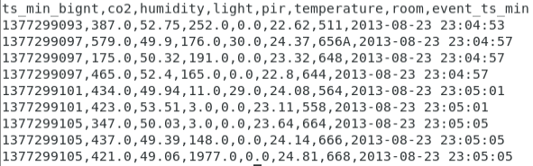

**_NOTE:_** With this step, we have our data ready. You can see it as `sensors.csv` in this repo.

### Creating the Kafka Topic:

The script `kafka_admin_client.py` under the folder `kafka_admin_client` can be used to
create a Kafka topic or prints the `already_exists` message if there is already a Kafka topic
with that name.

We can check if topic has been created as follows:

```
kafka-topics.sh --bootstrap-server localhost:9092 --list
```

### Running data-generator:

Instructions on how to install data-generator can be found [here](https://github.com/dogukannulu/data-generator)

This repo has been forked from [erkansirin78](https://github.com/erkansirin78). Many thanks to him since 
this script successfully simulates a streaming data.

We can directly run the data-generator script by running `data_generator.sh`. We should use
the location of data-generator.

Streaming data example:

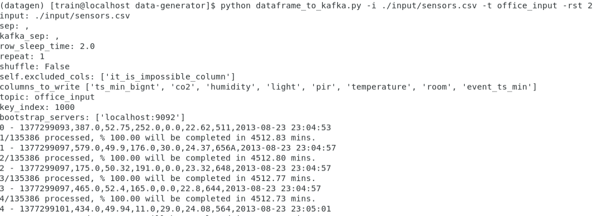

### Writing data to Elasticsearch using Spark Streaming:

We can access to Elasticsearch UI via `localhost:5601`

All the methods and operations are described with comments and docstrings in 
`spark_to_elasticsearch.py`.

Sample Elasticsearch data:

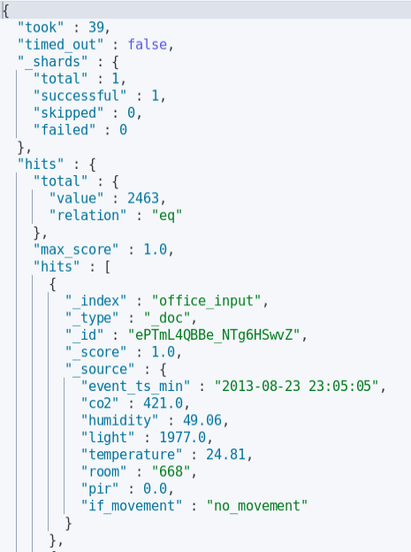

We can run this script by running `spark_to_elasticsearch.sh`. This script also runs the 
Spark virtualenv.

Logs of the script:

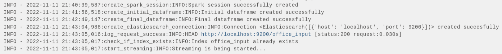

### Writing data to MinIO using Spark Streaming:

We can access to MinIO UI via `localhost:9001`

All the methods and operations are described with comments and docstrings in 
`spark_to_minio.py`.


We can run this script by running `spark_to_minio.sh`. This script also runs the 
Spark virtualenv.

Sample MinIO data:
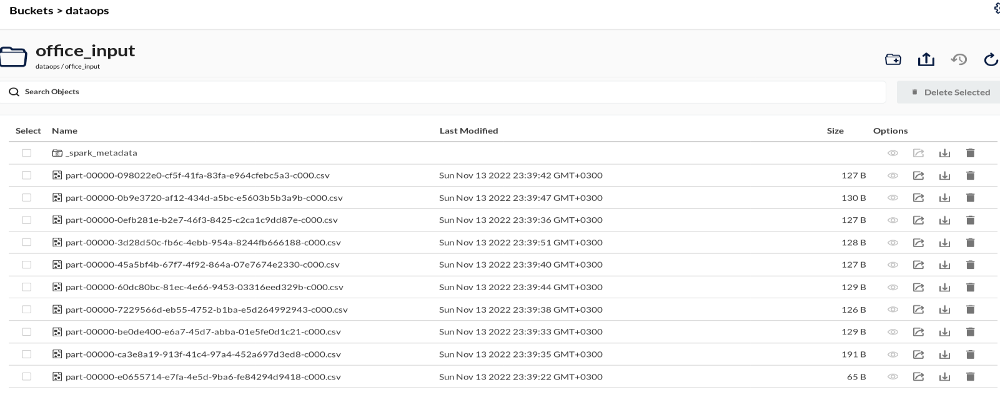

**_NOTE:_** We can also check the running Spark jobs via `localhost:4040`

### Airflow DAG Trigger:

We can trigger the Airflow DAG on `localhost:1502`. Triggering the DAG will do all the above 
explained data pipeline with one click. 

Airflow DAG:

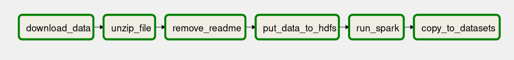

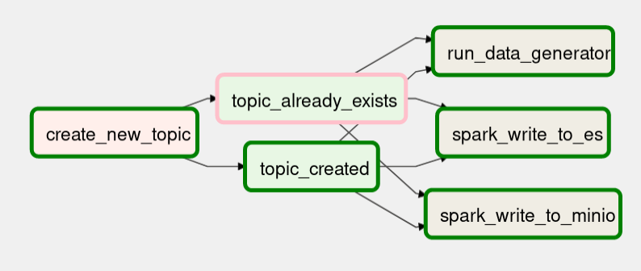


Running streaming applications on Airflow may create some issues. In that case, we can run
bash scripts instead.


### Create Dashboard on Elasticsearch/Kibana:

We can check the amount of streaming data (and the change of the amount) 
in Elasticsearch by running the following command:

```
GET /_cat/indices?v
```

We can create a new dashboard using the data in office_input index. Here are some sample graphs:

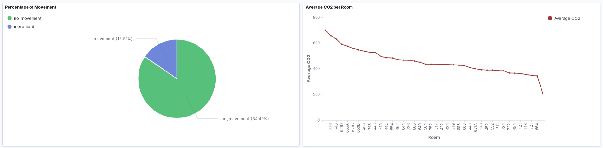
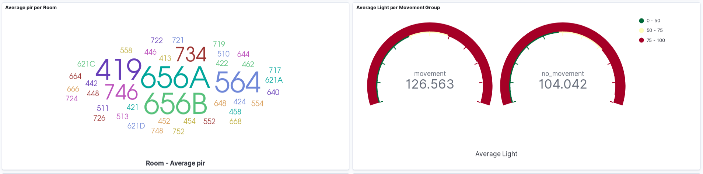
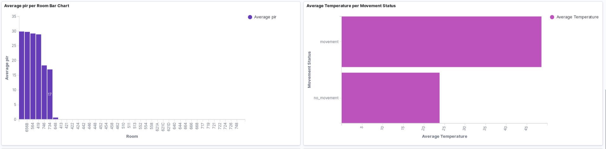
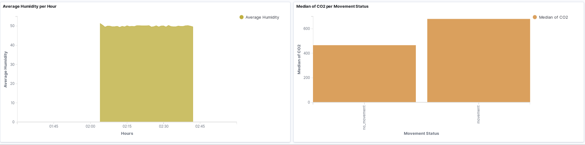

Which contains:
- Percentage of Movement Pie Chart
- Average CO2 per room Line Chart
- Average pir per Room Absolute Value Graph
- Average Light per Movement Status Gauge
- Average pir per Room Bar Chart
- Average Temperature per Movement Bar Chart
- Average Humidity per Hour Area Chart
- Median of CO2 per Movement Status Bar Chart
