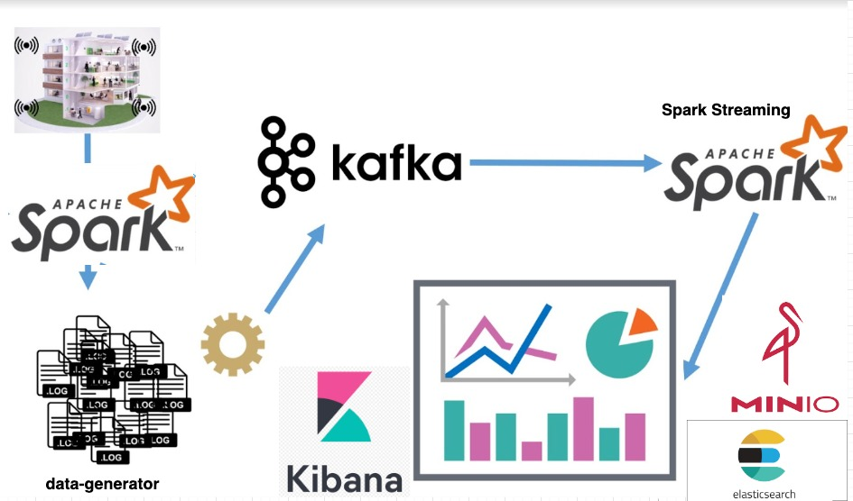

# Streaming Data Processing

- Take a compressed data source from a URL
- Process the raw data with **PySpark**, and use **HDFS** as file storage.
- Use **data-generator** to simulate streaming data, and send the data to **Apache Kafka**.
- Read the streaming data from Kafka topic using **PySpark (Spark Streaming)**.
- Write the streaming data to **ElasticSearch**, and visualize it using **Kibana**.
- Write the streaming data to **MinIO (AWS Object Storage)**.

